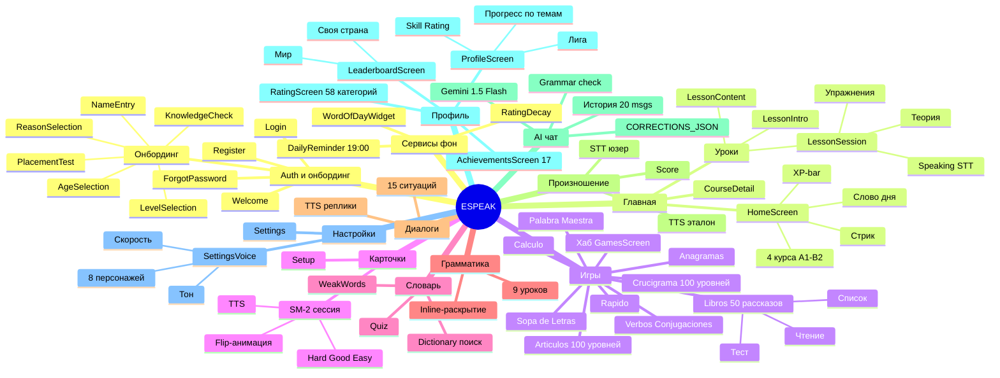
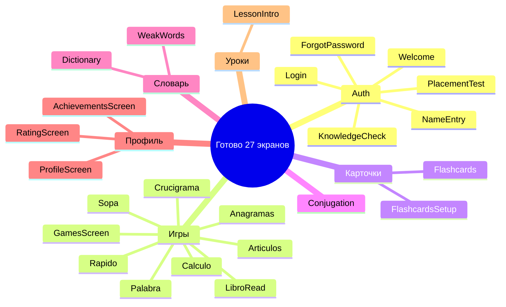
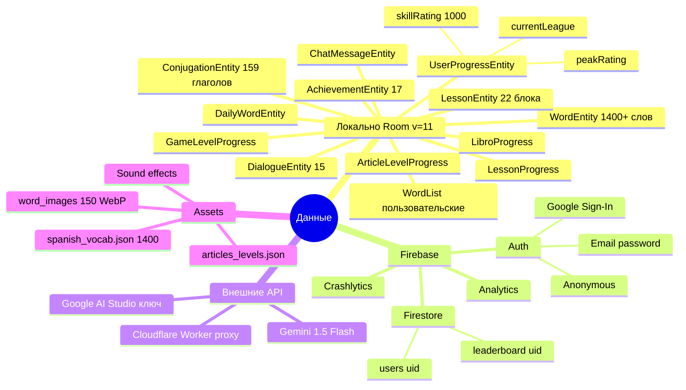
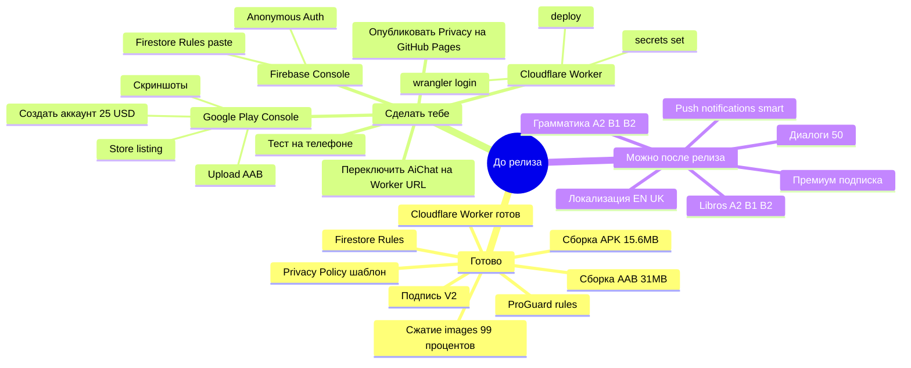

# SpanishApp / ESPEAK — карта приложения

> Mermaid mindmap. Откроется автоматически в:
> GitHub, GitLab, Notion, VS Code (плагин Markdown Preview Mermaid Support),
> Obsidian, Cursor, Typora, любой современный markdown-просмотрщик.

## Полная структура

---

## Только готовые экраны (зелёные ✅)

---

## Архитектура данных

---

## Roadmap до релиза

---

## Если нужен .xmind файл

Скажи — сгенерирую и положу в `docs/ESPEAK.xmind`.
Также могу выгрузить в:
- `.mm` (FreeMind/XMind import)
- PNG через mermaid-cli
- Интерактивный HTML через markmap-cli
